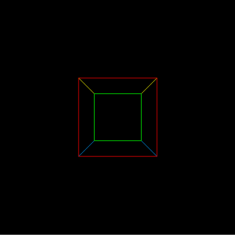

# Cube3D
An implementation of a 3D Cube Renderer, using SDL (used only for creating window and plotting/coloring pixels).

The lines are drawn using Xiaolin Wu's Algorithm (for smoother/anti-aliased lines).

# Demo


# How to Compile
## Pre-requisites:
* Any C++ compiler. g++ is recommended.
* Make (if you are on linux to automate compile and run)
* SDL2.0 Development Libraries

## Getting SDL
### On Windows (for MinGW):
1. Go to libSDL2.0 download page: [here](http://libsdl.org/download-2.0.php "libSDL2.0 Download Page")
2. Under Development Libraries -> Windows, download the tar archive for MinGW.
3. Now, copy and paste the **appropriate** files from the archive in your MinGW directory (usually C:\\MinGW\\).

   For **32-bit** installation of MinGW, copy the contents of *"i686-w64-mingw32"* folder in archive and paste in C:\\MinGW\\.  
   For **64-bit** installation of MinGW, copy the contents of *"x86_64-w64-mingw32"* folder in archive and paste in C:\\MinGW\\.  

4. You are done with installation of necessary SDL files to compile the program.

### On Arch:
Run this command in terminal:
```terminal
sudo pacman -S sdl2
```
**OR** use your favorite package manager if you are not a fan of pacman.

### On Ubuntu/Debian based OS:
Install the libsdl2-2.0 and libsdl2-dev using your favorite package manager.
An example command using apt would look like this: 
```terminal
sudo apt install libsdl2-2.0 libsdl2-dev
```

## Compiling
### On Linux:
Navigate to src directory in terminal and type the following command to compile the program.cpp file:
```terminal
g++ main.cpp -Ofast -lSDL2 -o program.out 
```

-Ofast flag tells the compiler to optimize the program for best performance. You can modify this flag to your liking.

To run the program, type the following command while in the same directory:
```terminal
./program.out
```

### On Windows (using MinGW and g++)
Navigate to the src directory in command prompt and type in the following command:
```terminal
g++ main.cpp -Ofast -lmingw32 -lSDL2main -lSDL2 -o program.exe
```
To run the program, type the following command while command prompt is in the same directory:
```terminal
program
```

# User Guide
Run the program and you will be shown a 3D Cube.

Use the following keys to interact with the cube:

| Key                   | Effect                                   |
|:---------------------:|:----------------------------------------:|
| Left/Right Arrow Keys | Translates/Rotates along X axis          |
| Up/Down Arrow Keys    | Translates/Rotates along Y axis          |
| Numpad +/-            | Translates/Rotates along Z axis          |
| R                     | Toggles between Translate or Rotate Mode |
